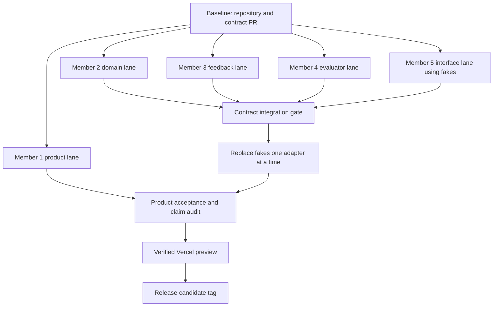

# Yom Awel Parallel Delivery Implementation Plan

> **For agentic workers:** REQUIRED SUB-SKILL: Use superpowers:subagent-driven-development (recommended) or superpowers:executing-plans to implement this plan task-by-task. Steps use checkbox (`- [ ]`) syntax for tracking.

**Goal:** Deliver the approved Yom Awel platform through five concurrently owned workstreams that integrate through frozen contracts and reviewed pull requests.

**Architecture:** A modular Python monolith exposes application use cases through FastAPI and a Telegram webhook, while a Next.js web application consumes the same API. Supabase Free supplies Postgres and private artifact storage; Gemini free-tier supplies optional coaching behind a deterministic fallback. Two Vercel Hobby projects deploy the web and API without a mandatory paid dependency.

**Tech Stack:** Python 3.12, FastAPI, Pydantic 2, pytest, SQLite, Supabase Postgres/Storage, Gemini free-tier, Next.js 16 App Router, TypeScript, Playwright, Vercel Hobby, GitHub Actions.

**Spec:** `docs/superpowers/specs/2026-09-20-yom-awel-platform-design.md`

## Global Constraints

- Deterministic evaluation is the sole authority for pass/fail, progression, and skill evidence.
- No required path may need a paid plan, billing account, paid add-on, metered overage, or paid model.
- Vercel deployment uses two Hobby projects connected to the personal GitHub repository.
- Supabase usage stays within the Free plan and has SQLite/local-file fallback for development.
- Gemini receives anonymized structured evaluation data only; raw artifacts and learner PII never leave the application boundary.
- Gemini failure, missing credentials, quota, refusal, or timeout produces valid deterministic Arabic feedback.
- Uploads are private, use generated artifact IDs, and are limited to 5 MB.
- Every exposed Supabase table has RLS and explicit allow/deny tests.
- Web and Telegram invoke the same application services; transports contain no scoring or progression rules.
- Shared contracts change only through `docs/team/collaboration-protocol.md`.
- All direct dependencies and toolchains are locked in committed lockfiles before their lane merges.
- Arabic RTL, keyboard operation, accessible names, and non-color status indicators are release requirements.

## Review Focus

- Duplicate Telegram updates or client retries must return the original outcome without creating a second attempt or advancing twice; Member 2 owns the test and Member 5 replays it end to end.
- A malformed, MIME-spoofed, highly compressed, or oversized workbook must fail safely without exhausting the Vercel function; Member 4 owns evaluator tests and Member 5 owns transport limits.
- Gemini timeout, quota, refusal, malformed JSON, or Arabic-language failure must return deterministic feedback without changing the grade; Member 3 owns provider tests and Member 5 owns the visible fallback state.
- A learner must never read another learner's attempt, artifact, profile, or signed URL; Member 2 owns RLS tests and Member 5 owns API authorization tests.
- Mixed Arabic/English technical content must remain readable in RTL, including errors and score details; Member 5 owns browser tests and Member 1 owns copy acceptance.

---

## Plan Set

| Lane | Detailed plan | Required reviewers |
|---|---|---|
| Member 1 — Product and Release | `docs/superpowers/plans/2026-09-20-member-1-product-release.md` | Member 1 plus affected code owner |
| Member 2 — Domain and Persistence | `docs/superpowers/plans/2026-09-20-member-2-domain-persistence.md` | Member 2 plus consumer owner |
| Member 3 — AI Feedback | `docs/superpowers/plans/2026-09-20-member-3-ai-feedback.md` | Members 3 and 1 |
| Member 4 — Evaluation | `docs/superpowers/plans/2026-09-20-member-4-evaluation.md` | Members 4 and 1 |
| Member 5 — Experience and Integration | `docs/superpowers/plans/2026-09-20-member-5-experience-integration.md` | Member 5 plus affected owner |

## File Ownership Map

```text
Member 1
  submission/**
  docs/product/**
  task_packages/**/content/**

Member 2
  services/api/src/yom_awel/domain/**
  services/api/src/yom_awel/application/**
  services/api/src/yom_awel/ports/**
  services/api/src/yom_awel/persistence/**
  contracts/schemas/**
  contracts/fixtures/**
  supabase/migrations/**

Member 3
  services/api/src/yom_awel/feedback/**
  services/api/tests/feedback/**

Member 4
  services/api/src/yom_awel/evaluation/**
  services/api/tests/evaluation/**
  task_packages/**/data/**

Member 5
  apps/web/**
  services/api/api/**
  services/api/src/yom_awel/transport/**
  tests/integration/**
  tests/e2e/**
  apps/web/vercel.json
  services/api/vercel.json
  .github/workflows/**
```

The API dependency manifest is owned by Member 2 and reviewed by Member 5 when runtime/deployment behavior changes. The web manifest is owned by Member 5. Canonical contracts are changed by Member 2 with every affected consumer's approval. Member 2's retention workflow is a cross-lane `.github/workflows/**` change and therefore requires Member 5 approval.

## Frozen Cross-Lane Interfaces

```python
class Evaluator(Protocol):
    async def evaluate(
        self,
        task: TaskVersion,
        artifact: ArtifactRef,
    ) -> EvaluationResult: ...


class FeedbackProvider(Protocol):
    async def generate(
        self,
        task: TaskVersion,
        evaluation: EvaluationResult,
        learner_note: str | None,
    ) -> FeedbackResult: ...


class ProcessSubmission(Protocol):
    async def execute(
        self,
        command: ProcessSubmissionCommand,
    ) -> SubmissionOutcome: ...
```

Member 2 publishes JSON fixtures for:

```text
evaluation-pass.json
evaluation-fail.json
feedback-generated.json
feedback-fallback.json
submission-pass.json
submission-fail.json
submission-duplicate.json
skills-profile.json
application-error.json
```

Members 3–5 build against these fixtures before real adapters are available.

## Parallel Execution Graph



## Merge Sequence

1. **Baseline PR:** toolchain, target directories, initial contracts, fixtures, and test commands.
2. **Parallel lane PRs:** lane-local changes may merge in any order after their contract tests pass.
3. **Persistence PR:** migrations, RLS, repository adapters, and local parity.
4. **Integration PRs:** Member 5 replaces evaluator, feedback, and persistence fakes separately.
5. **Security/zero-cost PR:** full negative suite, quota behavior, and bundle/config checks.
6. **Release PR:** product claims, submission artifacts, preview evidence, and final runbook.

## Task 1: Establish the GitHub Work Board and Repository Governance

**Files:**
- Create: `.github/ISSUE_TEMPLATE/work-item.yml`
- Create: `.github/CODEOWNERS`
- Create: `docs/team/work-board.md`
- Create: `docs/team/traceability.yaml`
- Create: `docs/team/reviewer-roster.yaml`
- Create: `docs/operations/github-ruleset.md`
- Create: `services/api/pyproject.toml`
- Create: `services/api/uv.lock`
- Modify: `docs/team/README.md`
- Test: `tests/documentation/test_repository_governance.py`
- Test: `tests/documentation/test_plan_commands.py`

**Interfaces:**
- Consumes: the five lane plans and collaboration protocol.
- Produces: a uniform issue shape and dependency-aware issue catalog.

- [ ] **Step 1: Bootstrap the locked validation runtime**

Create the API project manifest exactly as specified in Member 2 Task M2-1 and generate `services/api/uv.lock`. Include pytest and PyYAML so repository-root documentation/security validators run with `uv run --project services/api`. Member 2 owns this shared manifest and Member 5 reviews runtime/deployment additions.

- [ ] **Step 2: Add the failing documentation assertion**

Create `tests/documentation/test_work_board.py` with:

```python
from pathlib import Path


def test_work_board_lists_every_lane_and_gate() -> None:
    text = Path("docs/team/work-board.md").read_text(encoding="utf-8")
    for marker in (
        "M1-",
        "M2-",
        "M3-",
        "M4-",
        "M5-",
        "GATE-CONTRACT",
        "GATE-INTEGRATION",
        "GATE-RELEASE",
    ):
        assert marker in text
```

- [ ] **Step 3: Run the documentation assertion and confirm failure**

Run: `uv run --project services/api pytest tests/documentation/test_work_board.py -q`

Expected: FAIL because `docs/team/work-board.md` does not exist.

- [ ] **Step 4: Create the issue form**

Create `.github/ISSUE_TEMPLATE/work-item.yml` with required fields for owner, lane, outcome, acceptance criteria, paths, contracts, dependencies, tests, security/privacy impact, zero-cost impact, and reviewers. Configure lane options exactly as `Member 1` through `Member 5` plus `Cross-lane gate`.

- [ ] **Step 5: Create the work-board catalog**

Create `docs/team/work-board.md` listing every task heading from all five member plans with stable IDs, owner, dependency IDs, required reviewer, and initial state `Backlog`. Add the three gate IDs required by the test. Create `docs/team/traceability.yaml` mapping each platform success criterion to its owner, plan task ID, automated test path, preview check, and release-evidence path; the governance test rejects an unmapped criterion or nonexistent owner/task ID.

- [ ] **Step 6: Link the catalog from the team index**

Add a `Work tracking` section to `docs/team/README.md` linking the issue form, work-board catalog, and pull-request protocol.

- [ ] **Step 7: Add reviewer enforcement**

Record all five verified GitHub usernames and independent backup roles in `docs/team/reviewer-roster.yaml`. Generate `.github/CODEOWNERS` for lane-owned paths from that roster. Document the `main` repository ruleset: pull request required, approval counts from the review matrix, stale approvals dismissed, required CI/contract/security checks, conversation resolution, no force pushes, no deletions, and no self-merge. `test_repository_governance.py` asserts every owned path has a CODEOWNERS entry and every role has a non-self backup.

Add `test_plan_commands.py` to parse shell code blocks in every implementation plan, track explicit `cd` changes within each block, and assert referenced repository paths resolve from that working directory. Maintain an allowlist only for files explicitly declared as future `Create`/`Test` outputs in the same task. This prevents incorrect `../` paths and commands that stage from the wrong directory.

- [ ] **Step 8: Verify the governance and documentation assertions**

Run: `uv run --project services/api pytest tests/documentation -q`

Expected: PASS.

- [ ] **Step 9: Commit**

```bash
git add .github/ISSUE_TEMPLATE/work-item.yml .github/CODEOWNERS docs/team docs/operations/github-ruleset.md tests/documentation services/api/pyproject.toml services/api/uv.lock
git commit -m "build: establish governed implementation baseline"
```

## Task 2: Merge the Contract Baseline

**Files:**
- Create: `services/api/src/yom_awel/domain/contracts.py`
- Create: `services/api/src/yom_awel/ports/repositories.py`
- Create: `services/api/src/yom_awel/ports/artifacts.py`
- Create: `services/api/src/yom_awel/ports/evaluation.py`
- Create: `services/api/src/yom_awel/ports/feedback.py`
- Create: `services/api/src/yom_awel/ports/unit_of_work.py`
- Create: `contracts/schemas/evaluation-result.json`
- Create: `contracts/schemas/feedback-result.json`
- Create: `contracts/schemas/submission-outcome.json`
- Create: `contracts/schemas/skills-profile.json`
- Create: `contracts/schemas/application-error.json`
- Create: `contracts/fixtures/evaluation-pass.json`
- Create: `contracts/fixtures/evaluation-fail.json`
- Create: `contracts/fixtures/feedback-generated.json`
- Create: `contracts/fixtures/feedback-fallback.json`
- Create: `contracts/fixtures/submission-pass.json`
- Create: `contracts/fixtures/submission-fail.json`
- Create: `contracts/fixtures/submission-duplicate.json`
- Create: `contracts/fixtures/skills-profile.json`
- Create: `contracts/fixtures/application-error.json`
- Delete after replacement is verified: `agents/__init__.py`
- Delete after replacement is verified: `bot/__init__.py`
- Delete after replacement is verified: `core/__init__.py`
- Delete after replacement is verified: `evaluators/__init__.py`
- Delete after `services/api/pyproject.toml` and `uv.lock` exist: `requirements.txt`
- Test: `services/api/tests/contract/test_contract_snapshots.py`
- Test: `tests/documentation/test_repository_layout.py`

**Interfaces:**
- Consumes: canonical signatures in this plan and the platform design.
- Produces: versioned Pydantic models, ports, schemas, and fixtures used by Members 3–5.

- [ ] **Step 1: Execute Member 2 Tasks M2-1 through M2-3**

Follow `docs/superpowers/plans/2026-09-20-member-2-domain-persistence.md` through canonical contracts, domain types, exact port protocols, in-memory reference adapters, and their failing/passing tests. Parallel lanes do not start until evaluator, feedback, artifact, repository, and unit-of-work signatures are importable and frozen.

- [ ] **Step 2: Request consumer reviews**

Request Members 3, 4, and 5. Each reviewer loads their consumed fixture in a focused contract test before approval.

- [ ] **Step 3: Remove the retired scaffold after replacement exists**

After the locked `services/api` project and canonical packages exist, delete the four empty top-level Python packages and the root `requirements.txt`. `test_repository_layout.py` fails if retired imports, retired run commands, or the unpinned root manifest return. Do not delete any non-empty user implementation; migrate it through a separately reviewed change if these files stop being empty before execution.

- [ ] **Step 4: Run the contract gate**

Run:

```bash
cd services/api
uv run pytest tests/contract -q
uv run mypy src
cd ../.. && uv run --project services/api pytest tests/documentation/test_repository_layout.py -q
```

Expected: all tests pass and mypy reports no errors.

- [ ] **Step 5: Merge and tag the baseline**

After required reviews and green checks, squash merge the baseline PR and create the annotated tag:

```bash
git tag -a contracts-v1 -m "Yom Awel canonical contracts v1"
git push origin contracts-v1
```

## Task 3: Start Five Parallel Lanes

**Files:**
- No shared file edits in this coordination task.
- Each lane uses only its ownership map unless a reviewed cross-lane change is required.

**Interfaces:**
- Consumes: `contracts-v1` schemas and fixtures.
- Produces: five independently reviewable lane pull requests.

- [ ] **Step 1: Create branches from the contract tag**

```bash
git switch main
git pull --ff-only
git switch -c member-1/product-release contracts-v1
```

Repeat from `contracts-v1` with branch names:

```text
member-2/domain-persistence
member-3/ai-feedback
member-4/evaluation
member-5/experience-integration
```

- [ ] **Step 2: Open five draft pull requests**

Each member completes `.github/PULL_REQUEST_TEMPLATE.md`, links their work-board issue IDs, names consumed contracts, and lists files other members must not edit concurrently.

- [ ] **Step 3: Execute lane plans independently**

Each member executes their detailed plan in order. Member 5 remains on canonical fakes until a real adapter's pull request passes the contract gate.

- [ ] **Step 4: Publish daily GitHub updates**

Each member adds one issue comment containing completed checkboxes, next task ID, blocker link, and contract question. Decisions made elsewhere are copied into the issue before work continues.

## Task 4: Run the Contract Integration Gate

**Files:**
- Modify: `tests/contract/**`
- Modify: `tests/integration/**`
- Modify: `contracts/fixtures/**` only through the contract-change protocol.

**Interfaces:**
- Consumes: real Member 2–4 modules and Member 5 fakes.
- Produces: verified real-adapter replacements with unchanged transport behavior.

- [ ] **Step 1: Integrate the evaluator**

Replace only the fake `Evaluator` binding with Member 4's implementation. Run:

```bash
cd services/api
uv run pytest tests/contract tests/evaluation ../../tests/integration/test_submission_evaluator.py -q
```

Expected: pass/fail outcomes match the canonical fixtures.

- [ ] **Step 2: Integrate feedback**

Replace only the fake `FeedbackProvider` binding with Member 3's provider/fallback chain. Run:

```bash
cd services/api
uv run pytest tests/contract tests/feedback ../../tests/integration/test_submission_feedback.py -q
```

Expected: provider and fallback outputs match schema and never change evaluation state.

- [ ] **Step 3: Integrate persistence**

Replace in-memory repositories with Member 2's SQLite adapter in CI and Supabase adapter in the integration environment. Run:

```bash
cd services/api
uv run pytest tests/contract tests/persistence ../../tests/integration/test_submission_transaction.py -q
```

Expected: duplicate requests return the original outcome and pass advances once.

- [ ] **Step 4: Run the complete API integration suite**

Run: `cd services/api && uv run pytest tests ../../tests/integration -q`

Expected: all tests pass without a Gemini key or Supabase cloud credentials by using local adapters.

- [ ] **Step 5: Commit each adapter replacement separately**

Use commits:

```text
feat: integrate spreadsheet evaluator
feat: integrate resilient feedback provider
feat: integrate persistent submission workflow
```

## Task 5: Verify Security and Zero-Cost Invariants

**Files:**
- Create: `tests/security/test_upload_boundaries.py`
- Create: `tests/security/test_cross_learner_access.py`
- Create: `tests/security/test_prompt_redaction.py`
- Create: `tests/security/test_zero_cost_config.py`
- Create: `docs/operations/zero-cost-runbook.md`

**Interfaces:**
- Consumes: complete integrated API, web app, migrations, and environment templates.
- Produces: release-blocking proof that security and free operation match the spec.

- [ ] **Step 1: Add the zero-cost configuration test**

Implement assertions that fail if manifests or Vercel configuration reference Pro-only memory, paid marketplace services, billing account requirements, custom paid domains, or a non-optional paid model.

- [ ] **Step 2: Add upload boundary tests**

Test 5 MB acceptance, one-byte-over rejection, MIME spoofing, invalid workbook, excessive expanded size, and generated object paths.

- [ ] **Step 3: Add cross-learner access tests**

Create two learners and assert learner A cannot read learner B's submission, artifact authorization, attempt, or profile through API and Supabase policy paths.

- [ ] **Step 4: Add prompt redaction tests**

Assert email, Telegram ID, service keys, object paths, and raw workbook values do not appear in the provider request fixture.

- [ ] **Step 5: Write the zero-cost runbook**

Document Vercel Hobby's personal non-commercial demo eligibility, Supabase Free, Gemini free/fallback, local-only startup, quota symptoms, pause behavior, release-time terms revalidation, the explicit prohibition on paid trials/add-ons, and the requirement for a new hosting ADR before commercial or organizational use.

- [ ] **Step 6: Run the release security gate**

Run:

```bash
uv run --project services/api pytest tests/security -q
```

Expected: all tests pass.

- [ ] **Step 7: Commit**

```bash
git add tests/security docs/operations/zero-cost-runbook.md
git commit -m "test: enforce security and zero-cost boundaries"
```

## Task 6: Verify Vercel Previews

**Files:**
- Modify: `.github/workflows/ci.yml`
- Modify: `.github/workflows/preview.yml`
- Create: `docs/operations/vercel-preview-checklist.md`

**Interfaces:**
- Consumes: two Vercel Hobby projects and integrated applications.
- Produces: verified preview URLs for the exact release candidate.

- [ ] **Step 1: Run all local gates before deployment**

```bash
cd services/api && uv run pytest -q && uv run mypy src && uv run ruff check .
cd ../../apps/web && npm test && npm run lint && npm run typecheck && npm run build
```

Expected: all commands pass.

- [ ] **Step 2: Deploy API preview**

Deploy `services/api` to its Hobby preview project using the pinned Vercel CLI and record the immutable preview URL in the pull request.

- [ ] **Step 3: Deploy web preview**

Deploy `apps/web` with `NEXT_PUBLIC_API_BASE_URL` set to the API preview URL. Record the immutable web preview URL.

- [ ] **Step 4: Execute preview smoke tests**

Run:

```bash
cd apps/web
npx playwright test --project=chromium
```

Expected: onboarding, fail, retry, pass, profile, and fallback flows pass against preview.

- [ ] **Step 5: Complete the preview checklist**

Verify incognito access, Arabic RTL, keyboard navigation, private artifact behavior, redacted logs, API health, and no paid setting.

- [ ] **Step 6: Commit checklist evidence links**

```bash
git add .github/workflows docs/operations/vercel-preview-checklist.md
git commit -m "ci: gate releases on verified Vercel previews"
```

## Task 7: Release Candidate Review

**Files:**
- Create: `submission/release-checklist.md`
- Create: `submission/claim-to-evidence.md`
- Create: `submission/demo-script.md`
- Create: `submission/release-manifest.json`

**Interfaces:**
- Consumes: verified preview, all lane acceptance reports, commit SHA, tests, screenshots, and source register.
- Produces: an auditable release candidate and demonstration package.

- [ ] **Step 1: Run Member 1's final acceptance tasks**

Follow the release tasks in `docs/superpowers/plans/2026-09-20-member-1-product-release.md` and record every claim's evidence.

- [ ] **Step 2: Collect lane sign-offs**

Add GitHub issue comments from all five members confirming their plan acceptance criteria and unresolved risks. A missing sign-off blocks release.

- [ ] **Step 3: Rehearse degraded mode**

Disable the Gemini key in preview, submit a failing artifact, and verify deterministic Arabic feedback, retry, and unchanged grade behavior.

- [ ] **Step 4: Rehearse duplicate delivery**

Replay the same API idempotency key and Telegram update fixture. Verify one attempt, one progression update, and the original outcome.

- [ ] **Step 5: Create the release manifest**

Write `submission/release-manifest.json` with `tested_source_sha` for the exact code/configuration commit deployed to preview, web/API preview URLs, schema migration version, task/evaluator/prompt versions, test command results, and evidence artifact hashes. Do not attempt to place the future evidence-commit SHA inside a file contained by that same commit.

- [ ] **Step 6: Commit and review release evidence**

```bash
git add submission
git commit -m "docs: record verified release candidate"
```

- [ ] **Step 7: Revalidate and tag the evidence commit**

Re-run manifest validation and CI on the evidence commit. Confirm `tested_source_sha` still identifies the deployed application tree, then create and push the tag on the reviewed evidence commit:

```bash
git tag -a demo-v1 -m "Verified Yom Awel demo evidence"
git push origin demo-v1
```

Record both the tag commit and `tested_source_sha` in GitHub Release metadata, which is external to the tagged tree and therefore has no self-reference problem.

## Completion Gate

The implementation program is complete only when:

- every initial-release checkbox is complete; Member 4's explicitly later SQL and communication milestone is excluded until separately approved;
- all required pull-request approvals are recorded;
- contract, unit, integration, security, and end-to-end suites pass;
- two Vercel Hobby previews are verified;
- Gemini-free degraded mode passes;
- Supabase RLS allow/deny tests pass;
- duplicate submission and Telegram replay tests pass;
- Member 1's claim-to-evidence audit contains no unsupported current-state claim;
- `submission/release-manifest.json` identifies the exact tested source commit;
- the release tag points to the reviewed evidence commit and GitHub Release metadata links both commits.
