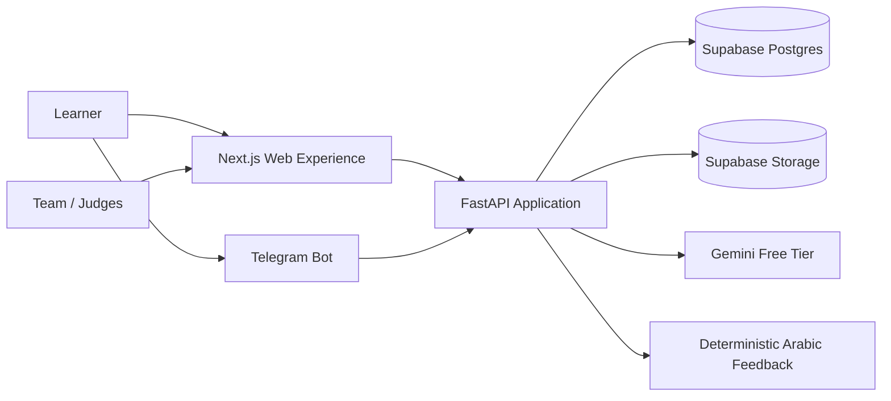
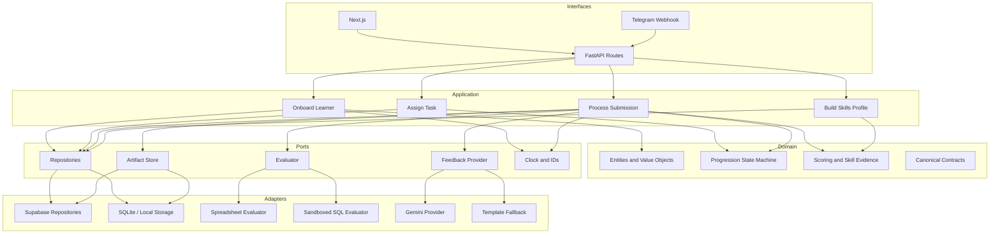
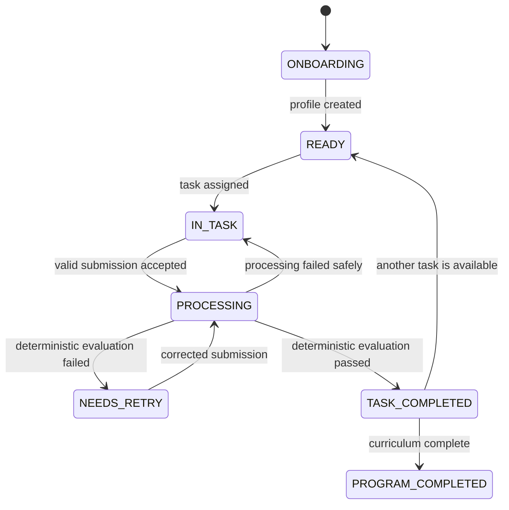
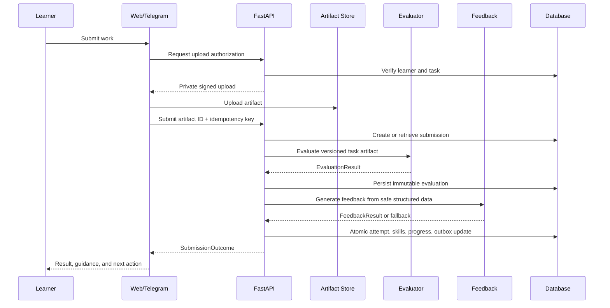

# Yom Awel Platform Design

- **Status:** Approved design baseline
- **Date:** 2026-09-20
- **Scope:** Architecture and delivery design only; no product implementation is included in this change.
- **Canonical source:** This document overrides conflicting architecture or ownership guidance in older repository documents.

## 1. Purpose

Yom Awel is an Arabic-first workplace simulation platform for learners preparing for entry-level digital and data roles. A learner joins a simulated Egyptian workplace, receives realistic assignments, submits real work artifacts, receives objective evaluation and contextual coaching, and builds an auditable competency profile.

The product must combine:

1. deterministic evaluation for factual correctness;
2. generative feedback for culturally appropriate coaching;
3. explicit, reproducible learner progression;
4. Telegram and web experiences backed by the same application services;
5. a zero-mandatory-cost deployment path;
6. modular boundaries that let five team members work concurrently.

## 2. Product principles

- **Evidence before claims:** The product and pitch may claim only capabilities demonstrated by the verified release candidate.
- **Determinism controls progression:** LLM output never determines pass/fail, task completion, or competency scores.
- **Arabic is a first-class interface:** Egyptian Arabic copy, RTL rendering, and culturally authentic workplace scenarios are product requirements.
- **One domain, many interfaces:** Telegram, web, and future channels call the same application use cases.
- **Secure by default:** Learner data, artifacts, secrets, and provider credentials are private unless explicitly published.
- **Graceful degradation:** The learner can finish the deterministic flow when Gemini, Telegram, Supabase, or Vercel is degraded.
- **Zero mandatory cost:** No accepted design decision requires a paid plan, card-backed service, paid add-on, or metered overage.
- **Portability:** Domain and evaluation code must not import Vercel, Supabase, Telegram, Gemini, or Next.js APIs.

## 3. Success criteria

The first production-shaped release is successful when:

- a learner can onboard through web or Telegram;
- the same task definition is presented consistently in both channels;
- the learner can securely obtain and submit an artifact;
- deterministic evaluation produces a versioned, reproducible result;
- generative or fallback feedback explains that result without changing it;
- failures allow a retry without corrupting state;
- a pass advances the learner exactly once;
- the skills profile is derived from recorded evidence;
- duplicate messages and requests do not create duplicate attempts;
- a public Vercel preview and production deployment run within free-tier limits;
- all release claims are traceable to tests or a verified preview.

## 4. Current repository state

At design time the repository contains planning documents, package initializers, and an unpinned dependency list. Runtime modules, task data, tests, deployment configuration, migrations, and submission artifacts do not yet exist. Existing README interfaces disagree with `TEAM_PROMPTS.md` on field names and responsibilities. This design resolves those contradictions before implementation begins.

## 5. Architectural decision

Use a **modular monolith with ports and adapters**.

This structure provides the isolation needed for five parallel workstreams without introducing distributed transactions, queues, cross-service versioning, or multi-service operational overhead before the domain is stable. Boundaries are enforced through Python packages, typed ports, contract tests, and file ownership. Modules may later be extracted into services without changing domain behavior.

Rejected alternatives:

- **Supabase-native serverless:** Does not naturally fit the Python, pandas, and openpyxl evaluation engine and would split the core language stack.
- **Event-driven microservices:** Adds deployment, tracing, consistency, retry, and queue complexity before scale requires it.
- **Conventional layered monolith:** Easy to begin but too weakly bounded for reliable five-member parallel development.

## 6. System context



External systems are adapters. Business decisions remain inside the application and domain modules.

## 7. Logical architecture



## 8. Module boundaries

### Domain

Owns entities, value objects, enums, invariants, scoring rules, state transitions, and domain errors. It depends only on the Python standard library and Pydantic-compatible data contracts where serialization is required.

The domain must not perform database, network, filesystem, provider, framework, or clock operations directly.

### Application

Owns use-case orchestration and transaction boundaries:

- onboard a learner;
- retrieve or assign the current task;
- create an upload authorization;
- process a submission;
- retry a failed task;
- retrieve an attempt;
- derive a learner skills profile;
- reset demo state through an explicitly protected administrative use case.

Application services depend on ports and domain types, never concrete adapters.

### Evaluation

Owns versioned deterministic graders and task-specific validation. Each evaluator consumes a task version and an artifact reference, then returns the canonical `EvaluationResult`. Evaluators are pure where practical and isolate any untrusted execution.

### Feedback

Owns persona definitions, prompt construction, provider calls, output validation, and deterministic fallback feedback. It consumes an `EvaluationResult` plus non-sensitive task context. It cannot update progression or scoring.

### Transport

Owns FastAPI routes, Telegram webhook translation, request validation, authentication context, response mapping, and the composition root. It contains no scoring or progression rules.

### Web

Owns the Next.js learner interface, Arabic RTL presentation, upload flow, accessible interaction states, and API client. It never receives service-role credentials and never reimplements backend domain logic.

## 9. Planned repository structure

```text
yom-awel/
├── apps/
│   └── web/                         # Next.js, owned by Member 5
├── services/
│   └── api/
│       ├── api/index.py             # FastAPI/Vercel entry point, Member 5
│       ├── pyproject.toml
│       └── src/yom_awel/
│           ├── domain/              # Member 2
│           ├── application/         # Member 2
│           ├── ports/               # Member 2, contract governed
│           ├── persistence/         # Member 2
│           ├── feedback/            # Member 3
│           ├── evaluation/          # Member 4
│           └── transport/           # Member 5
├── contracts/
│   ├── schemas/                     # Canonical JSON schemas/OpenAPI snapshots
│   └── fixtures/                    # Cross-lane test fixtures
├── task_packages/                   # Versioned learner tasks, Member 4 + Member 1
├── supabase/
│   └── migrations/                  # Member 2
├── tests/
│   ├── contract/
│   ├── integration/
│   ├── security/
│   └── e2e/
├── submission/                      # Member 1
├── docs/
│   ├── architecture/
│   ├── superpowers/specs/
│   ├── superpowers/plans/
│   └── team/
└── vercel.json                      # Member 5
```

Existing top-level Python packages are transitional scaffolding. The implementation plan will specify their removal or migration so two competing architectures do not remain.

## 10. Canonical contracts

All cross-module types are versioned. Field names may not be changed through an implementation pull request without the contract-change procedure.

### EvaluationResult

```python
class EvaluationResult(BaseModel):
    evaluator_id: str
    evaluator_version: str
    task_version_id: UUID
    passed: bool
    score: int  # 0..100
    checks: list[EvaluationCheck]
    errors: list[EvaluationError]
    summary_ar: str
    summary_en: str
    duration_ms: int
```

### FeedbackResult

```python
class FeedbackResult(BaseModel):
    feedback_text: str
    language: Literal["ar-EG", "en"]
    persona_id: str
    prompt_version: str
    provider: str
    model: str | None
    used_fallback: bool
    duration_ms: int
```

### SubmissionOutcome

```python
class SubmissionOutcome(BaseModel):
    submission_id: UUID
    attempt_id: UUID
    attempt_number: int
    evaluation: EvaluationResult
    feedback: FeedbackResult
    learner_status: LearnerStatus
    task_status: TaskStatus
    skills: list[SkillSummary]
```

Only `EvaluationResult.passed` may authorize progression. `FeedbackResult` contains no pass/fail override and no authoritative score.

## 11. Domain model and persistence

### learners

Represents the product identity. Stores `id`, display name, preferred language, lifecycle status, timestamps, and state-machine version. Direct provider identifiers are stored separately.

### external_identities

Maps a verified channel identity to a learner. Unique constraint: `(provider, provider_subject)`. Supported providers begin with `telegram` and `web`.

### tasks and task_versions

`tasks` identifies the stable learning objective. `task_versions` is immutable after publication and stores the instructions, artifact schema, evaluator ID/version, scoring threshold, skill mapping, and content hash.

### submissions

Stores an idempotency key, learner, task version, artifact ID, channel, processing status, timestamps, and content hash. Unique constraints prevent the same channel event or client idempotency key from creating multiple records.

### evaluation_results

Immutable record of deterministic output, evaluator version, structured checks, errors, score, pass state, duration, and creation timestamp.

### feedback_results

Stores validated feedback, language, persona, prompt version, provider/model, fallback flag, duration, and non-sensitive request hash.

### attempts

Links learner, task version, submission, evaluation, and feedback. Attempt numbers are unique per learner and task version. Attempts are append-only except for tightly scoped processing-status transitions.

### skill_definitions and skill_evidence

Skills have stable IDs and documented definitions. Evidence rows record which passed evaluation check contributed which weight. Displayed profiles are projections of evidence, not mutable arbitrary percentages.

### learner_progress

Stores active task, state, last completed task, optimistic concurrency version, and updated timestamp. State updates and attempt creation share one transaction.

### outbox_events

Records application events in the same transaction as domain changes. The first release may process them inline; the table preserves a reliable path to background workers later.

## 12. State machine



Invariants:

- a learner has at most one active task;
- an idempotency key yields the original outcome;
- failed evaluation never advances progress;
- a pass advances once even if the request is retried;
- feedback failure cannot reverse evaluation or progress;
- task and evaluator versions are recorded on every attempt;
- reset is administrative, audited, and unavailable through normal learner routes.

## 13. Submission flow



Telegram downloads are limited, validated, stored under generated IDs, and mapped into the same artifact workflow. The webhook is idempotent because Telegram may retry updates.

## 14. Error model and resilience

Errors use stable codes and learner-safe messages. Internal details appear only in redacted logs.

| Error class | Example | Application behavior |
|---|---|---|
| Validation | Unsupported type, file too large | Reject without creating an attempt |
| Authorization | Learner requests another learner's artifact | Deny, audit, reveal no existence details |
| Evaluation | Malformed workbook | Persist controlled failed evaluation when appropriate |
| Provider | Gemini timeout or quota | Produce deterministic fallback feedback |
| Persistence | Transaction conflict | Retry bounded safe operations using idempotency key |
| External channel | Telegram retry | Return existing submission/outcome |
| Infrastructure | Supabase unavailable | Preserve artifact locally in development; production returns retryable status |

Retry rules:

- retry only idempotent network operations;
- use exponential backoff with jitter and a strict attempt cap;
- never retry invalid learner input;
- use a short Gemini timeout so free-tier failure does not block the flow;
- store enough state to resume or safely restart processing;
- never expose stack traces, SQL, provider payloads, or secrets to learners.

## 15. Security and privacy

- Enable RLS on every exposed Supabase table.
- Keep internal operational data in non-public schemas where supported.
- Revoke unnecessary `anon` and `authenticated` grants.
- Store Supabase service-role and Gemini keys only in server-side Vercel secrets.
- Never expose service-role credentials through `NEXT_PUBLIC_*` variables.
- Use private storage buckets and short-lived signed upload/download URLs.
- Validate extension, MIME, signature, schema, compressed size, expanded size, and row limits.
- Store artifacts under generated UUID paths; ignore original path components.
- Delete temporary files in `finally` blocks and enforce a documented retention policy.
- Send only anonymized structured evaluation results to Gemini free tier.
- Separate untrusted learner text from system instructions and delimit it as data.
- Redact PII, secrets, learner messages, and artifact contents from logs.
- Do not execute student SQL against application data. Use an isolated, read-only database with statement and progress limits.
- Record security-relevant actions with a correlation ID and actor context.
- Test RLS allow and deny cases after every migration.

## 16. Zero-cost infrastructure

### Vercel Hobby

Use two projects sourced from the same personal GitHub repository:

- `apps/web` deploys the Next.js application;
- `services/api` deploys FastAPI through the Vercel Python runtime.

This avoids dependence on Vercel Services beta. Preview deployments are created for pull requests. Hobby overages must pause or throttle service rather than trigger charges. Do not enable Pro trials, paid marketplace integrations, on-demand resources, or paid custom domains.

### Supabase Free

Use one free project for shared development/demo and keep a second free-project allowance available for recovery if possible. Database and storage usage must be monitored against free limits. No paid add-ons, image transformations, read replicas, point-in-time recovery, or custom domains are required.

### Gemini Free

Use one documented free-tier model behind the provider port. The exact model is configuration, not a domain dependency. Rate limiting, quota exhaustion, or missing credentials activates deterministic Arabic feedback. No user PII or raw artifacts are sent.

### GitHub and Telegram

Keep the repository public so standard GitHub-hosted Actions remain free. Telegram Bot API usage stays within standard free messaging limits. The web experience remains the fallback when Telegram is unavailable.

### Local fallback

The application must run locally with:

- Next.js development server;
- FastAPI development server;
- SQLite repository adapter;
- local artifact directory;
- deterministic feedback provider.

This mode must not need a cloud account or billing method.

## 17. Vercel deployment design

- Vercel stores no durable local state; all durable records and artifacts live in Supabase.
- Python function dependencies are pinned and kept below the 500 MB uncompressed limit.
- Tests, fixtures, submission assets, and development data are excluded from the deployed Python bundle.
- Application uploads are capped at 5 MB even if platform limits are higher.
- Evaluation targets bounded CPU and memory usage and closes files/connections promptly.
- Telegram uses a webhook route; polling is local-development-only.
- Frontend/API URLs are environment-specific and never hard-coded.
- Pull requests deploy previews; production is promoted only from a verified preview artifact.
- The architecture does not rely on WebSockets, paid cron, paid observability, or a proprietary queue.

## 18. Non-functional requirements

### Reliability

- Idempotent channel and submission handling.
- Atomic attempt/progress updates.
- Deterministic feedback fallback.
- No single LLM call can block completion.
- Reproducible evaluation from stored versions.

### Performance

- Validate and accept an upload authorization request within 500 ms at p95, excluding cold start.
- Evaluate a supported 5 MB spreadsheet within 5 seconds at p95 on the target free runtime.
- Apply a 10-second Gemini response budget before fallback.
- Return skills profiles within 1 second at p95, excluding cold start.

These are release targets and must be measured rather than assumed.

### Accessibility and localization

- Arabic RTL is the default learner presentation.
- All controls are keyboard usable and have accessible names.
- Color is never the only indicator of pass/fail.
- Error and retry messages are available in Arabic.
- Dates, numbers, and mixed Arabic/English technical terms render predictably.

### Maintainability

- Public functions and cross-lane interfaces are typed.
- Each module has one responsibility and an owning member.
- No cyclic imports across domain/application/adapter boundaries.
- Architecture decisions that change boundaries receive an ADR.
- Dependency versions and lockfiles are committed.

## 19. Observability

Use structured JSON logs with:

- correlation ID;
- request/channel type;
- learner pseudonymous ID;
- task/evaluator/prompt version;
- duration and outcome;
- fallback usage;
- stable error code.

Do not log secrets, raw files, learner messages, provider prompts containing user data, or PII. Free Vercel and Supabase logs are sufficient for the planned scale; no paid telemetry dependency is required. A small internal health endpoint reports dependency reachability without exposing configuration.

## 20. Testing strategy

### Unit tests

- state transitions and invalid transitions;
- score boundaries and skill evidence;
- evaluator checks and task-version semantics;
- feedback validation and fallback selection;
- request validation and error mapping.

### Contract tests

- Pydantic/JSON schema snapshots;
- repository adapter parity;
- evaluator result schema;
- feedback provider behavior;
- generated web API client compatibility.

### Integration tests

- artifact upload through evaluation and persistence;
- failed and passed submission transactions;
- Gemini timeout fallback;
- Telegram webhook replay;
- Supabase migrations and RLS allow/deny behavior.

### Security tests

- path traversal and filename spoofing;
- malformed and oversized spreadsheets;
- zip-bomb/expanded-size limits;
- prompt injection and output validation;
- secret redaction;
- SQL write, attach, extension, recursion, and timeout attempts.

### End-to-end tests

- web onboarding, download, fail, retry, pass, and profile;
- Telegram onboarding, submission, feedback, and profile;
- missing-provider-key degraded mode;
- fresh-account and incognito preview smoke tests.

## 21. Delivery and review model

Five members work concurrently after the contract baseline merges. Each lane owns explicit paths and acceptance criteria. Integration uses fakes from the first day so the interface lane never waits for backend implementations.

The detailed assignments are:

- [Member 1: Product and Release](../../team/member-1-product-release.md)
- [Member 2: Domain and Persistence](../../team/member-2-domain-persistence.md)
- [Member 3: AI Feedback](../../team/member-3-ai-feedback.md)
- [Member 4: Evaluation](../../team/member-4-evaluation.md)
- [Member 5: Experience and Integration](../../team/member-5-experience-integration.md)

All communication, contract changes, review requirements, and merge gates follow [the collaboration protocol](../../team/collaboration-protocol.md).

## 22. Integration order

1. Merge the approved architecture, collaboration protocol, and contract definitions.
2. Create five short-lived member branches from the same baseline.
3. Members implement concurrently against canonical fixtures and fakes.
4. Merge contract-compatible domain, evaluation, and feedback lanes independently.
5. Replace Member 5's fakes with real adapters and run integration suites.
6. Verify preview deployments and all quality gates.
7. Member 1 audits every product claim against the release candidate.
8. Tag the exact verified commit used for the demo and submission.

## 23. Scope boundaries

The architecture supports but does not require these later capabilities:

- WhatsApp and additional messaging channels;
- voice input/output;
- employer dashboards;
- multi-organization tenancy;
- real-time collaboration;
- advanced adaptive sequencing;
- a graph-based competency model;
- paid hosting or model providers;
- extraction of modules into independent services.

These features require separate approved designs. They must not be implied as current functionality before implementation and verification.

## 24. Key risks and mitigations

| Risk | Mitigation |
|---|---|
| Free-tier quota exhaustion | Usage limits, fallback providers, local mode, and no-paid-service gate |
| LLM latency or outage | Strict timeout and deterministic Arabic fallback |
| Parallel implementation drift | Frozen contracts, fixtures, CODEOWNERS, and contract tests |
| Upload abuse | Private storage, signed URLs, limits, validation, and retention cleanup |
| Duplicate Telegram delivery | Channel event ID plus submission idempotency |
| Unreproducible grading | Immutable task/evaluator versions and stored structured results |
| Product overclaiming | Member 1 claim-to-evidence matrix and release sign-off |
| Serverless filesystem assumptions | Supabase durability and disposable local files only |
| Vercel Hobby restrictions | Personal-repository deployment, bounded functions, and local fallback |
| Gemini free-tier privacy | Anonymized structured inputs and no raw learner data |

## 25. Architecture governance

- This document is the design authority.
- The implementation plan may refine file paths and step order but may not change architectural decisions silently.
- Boundary changes require an ADR and affected-owner approval.
- Contract changes require updated schemas, fixtures, consumers, and contract tests in one pull request.
- Infrastructure additions require a zero-cost assessment.
- A merge is prohibited until the collaboration protocol's approvals and automated gates pass.
